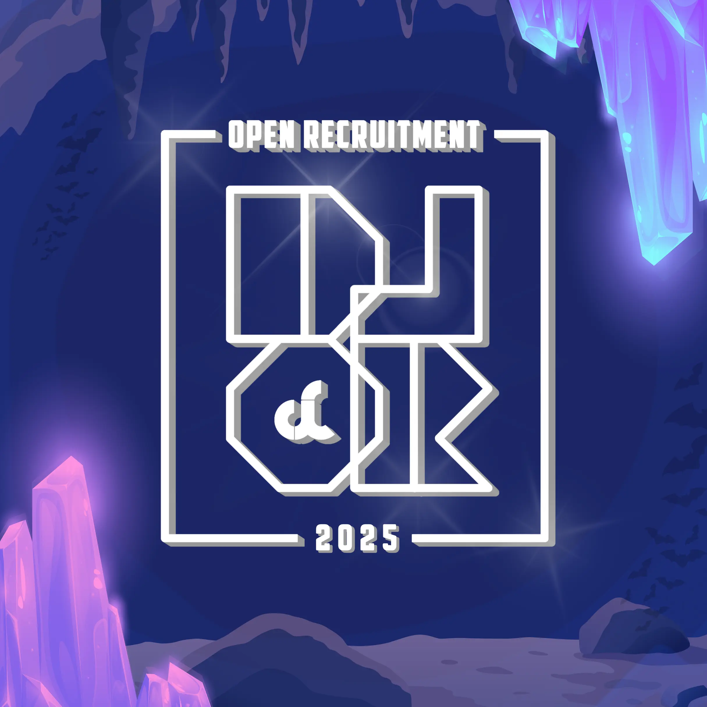

WELCOME TO DASKOM LABORATORY RECRUITMENT 2025

 

## About DLOR 2025  
_Open Recruitment Platform for Dasar Komputer Laboratory, Telkom University_

Welcome to the **DLOR 2025** repository! This project is dedicated to creating a modern, user-friendly platform for recruiting teaching assistants for the **Dasar Komputer Laboratory** at **Telkom University**.

## Project Summary  
DLOR 2025 is a recruitment platform designed to streamline the application process for teaching assistants. It features an intuitive UI, a secure backend, and an efficient application workflow.

## Features  
- User-friendly application form  
- Secure authentication system  
- Real-time updates on application status  
- Admin dashboard for managing recruitment  

## Team Members  
- [Aulia Rahma](https://github.com/pieceofaul) (AUL)  
- [Stevannie Pratama](https://github.com/stevanniep) (SNI)  
- [Umar Zaki Gunawan](https://github.com/marzkigun27) (UZY)  
- [Muhammad Zaenal Abidin Abdurrahman](https://github.com/Zendin110206) (ZEN)  
- [Muhammad Hafiz](https://github.com/mhafiz03) (MHZ)  
